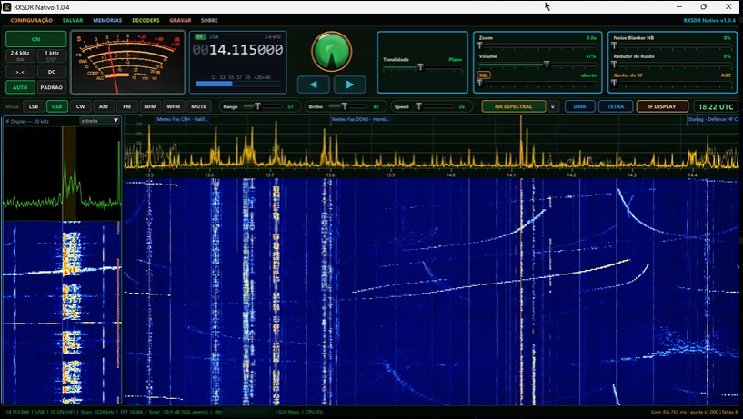
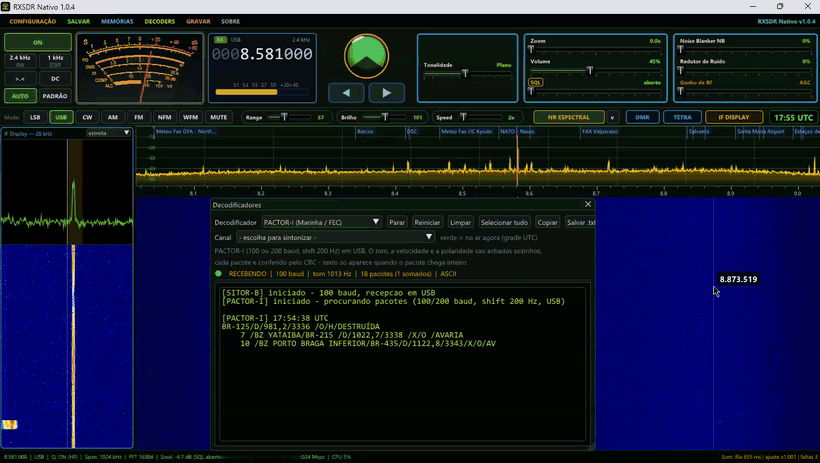

# RXSDR Nativo

Receptor SDR para Windows que roda **direto no Windows, sem navegador e sem
instalar** — descompacte a pasta e rode o `RXSDR.exe`, como nos SDR# antigos.
Funciona do **Windows 7 SP1 ao 11**, inclusive em PCs antigos ou mais fracos.
Em **português e inglês**.

Feito por **PU1XTB — Ruben**, radioamador e radioescuta, em Araruama/RJ.



### Em ação: PACTOR-I da Marinha do Brasil

Recepção da meteoromarinha e dos avisos aos navegantes em PACTOR-I
(8581 kHz), decodificados direto no RXSDR Nativo (vídeo acelerado 8x):



▶ [Vídeo completo, com som (2 min 38 s)](project-nativo/tela/rxsdr_nativo_pactor.mp4)

**[⬇ Baixar a última versão (Releases)](https://github.com/Rubenpereira/RXSDR/releases/latest)**

---

## English

**RXSDR Nativo** is a native Windows SDR receiver (Windows 7 SP1 to 11):
no browser, no installation — unzip the folder and run `RXSDR.exe`.
Supports RTL-SDR, RTL-TCP and SDRplay, with built-in decoders for CW, RTTY,
SITOR-B/NAVTEX, DSC, ALE 2G, PACTOR-I, SSTV, WEFAX, DRM, DMR/P25/NXDN, TETRA,
HFDL, ACARS, VDL2, AIS and APRS, plus an unknown-signal analyzer.
The interface is available in **English and Portuguese** (chosen on first
start, switchable at any time with the PT/EN button at the top).
Download the `RXSDR_Nativo_x.x.x.zip` from the
[Releases](https://github.com/Rubenpereira/RXSDR/releases/latest) page.

---

## O que ele faz

- Recepção em **AM, SAM, FM, NFM, WFM, USB, LSB e CW**
- **Espectro e cachoeira** com zoom, ajuste de range, brilho e velocidade.
  O botão **AUTO** ajusta a cor da cachoeira sozinho a cada banda, a partir
  do jeito que você deixou e gravou em **PADRÃO**
- **S-meter analógico** com referência S9 própria para HF e VHF, olho mágico,
  squelch com ajuste automático, AGC, ganho de RF, tonalidade,
  **Noise Blanker** e **redutor de ruído espectral**
- **IF Display** ao lado do espectro e **relógio UTC** (o das grades de horário
  das estações)
- **Botão direito na cachoeira**: lista das bandas (Ondas Médias, 160 a 10 m,
  PX, 6 m, FM, aviação, 2 m, marítimo, satélite, 70 cm...) — vai direto com o
  modo e a largura padrão
- **Memórias** com régua em cima do espectro, no formato do OpenWebRX
  (`bookmarks.json`), com filtros (utilitárias, broadcast no ar agora...)
- **Gravação** do áudio em WAV
- **Decodificadores** (menu DECODERS):

| Modo | O que recebe |
|---|---|
| **CW / Morse** | mede o tom e a velocidade sozinho |
| **RTTY** | radioamador e meteorologia (DWD) |
| **SITOR-B / NAVTEX** | avisos e meteorologia marítima, lista de estações com horários UTC |
| **DSC** | chamada seletiva digital (ITU-R M.493) |
| **PACTOR-I** | meteoromarinha e avisos da Marinha do Brasil, conferidos pelo CRC |
| **ALE 2G** | MIL-STD-188-141 |
| **SSTV** | imagens dos radioamadores (Robot, Martin, Scottie, PD...), salvas em PNG |
| **WEFAX** | fax meteorológico, com lista de estações e horários |
| **DRM** | rádio digital das ondas curtas (com o Dream) |
| **DMR / P25 / NXDN / D-STAR / YSF** | voz digital (com o dsd-fme) |
| **TETRA** | dados da célula e voz (osmo-tetra) |
| **HFDL / ACARS / VDL2** | mensagens de aviões, com link para o FlightAware |
| **AIS** | navios, com mapa e links para VesselFinder / MarineTraffic |
| **APRS** | VHF (1200 baud) e HF (300 baud) |
| **Analisar sinal** | mede tons, shift e velocidade de um sinal desconhecido e diz com que modos ele é compatível |

As listas de canais dos decodificadores marcam em verde o que está **no ar
agora** pela grade UTC e têm **campo de busca** (por frequência ou nome).
Ao escolher um canal, o rádio já sintoniza com o modo e a largura certos.

## Hardware suportado

| Dispositivo | Observação |
|---|---|
| RTL-SDR (todos os modelos) | precisa do driver WinUSB (Zadig), como no SDR# |
| RTL-TCP | rádio remoto pela rede |
| SDRplay (RSP1/1A/1B/2/duo/dx) | exige a [API oficial da SDRplay](https://www.sdrplay.com/api/) |

---

## Instalação

1. Baixe o **RXSDR_Nativo_x.x.x.zip** na aba
   [Releases](https://github.com/Rubenpereira/RXSDR/releases/latest).
2. Descompacte em qualquer pasta e rode o `RXSDR.exe`.
3. Na primeira abertura, escolha o idioma (Português / English).

**Portátil**: nada vai para o Registro do Windows. A configuração fica no
`RXSDR.ini` ao lado do programa — dá para levar a pasta para outro PC com tudo
junto. Duas cópias em pastas diferentes podem rodar ao mesmo tempo (por
exemplo, uma em HF e outra em VHF).

---

## Compilar a partir do código

Requisitos: Visual Studio 2019 ou superior (MSVC) e CMake 3.16+. Não usa Qt:
a tela é feita com Dear ImGui e Direct3D 9.

```
COMPILAR_NATIVO.bat       compila o RXSDR Nativo (pasta project-nativo)
GERAR_PACOTE_NATIVO.bat   gera o .zip portátil
```

Os decodificadores externos (dsd-fme, Dream, dumphfdl, acarsdec, dumpvdl2,
AIS-catcher, direwolf, osmo-tetra) são programas de outros autores, com
licenças próprias (veja `project-nativo/TERCEIROS.txt`). O pacote da aba
Releases já vem com eles.

---

## Versão web (encerrada)

A versão anterior do RXSDR, com o painel no navegador (Qt6, Windows 10 e 11),
ficou **congelada na 1.0.69** — o código continua na pasta `project` e o
instalador está na
[release 1.0.69](https://github.com/Rubenpereira/RXSDR/releases/tag/v1.0.69).
Daqui em diante o desenvolvimento segue só no RXSDR Nativo.

---

## Histórico de mudanças

Veja [CHANGELOG.md](CHANGELOG.md).

---

## Licença

O RXSDR é distribuído sob a licença que está em [LICENSE.txt](LICENSE.txt):
uso, modificação e redistribuição livres para fins **não comerciais**, desde
que os créditos ao autor inicial sejam mantidos.

## Créditos

- Tela: [Dear ImGui](https://github.com/ocornut/imgui) (MIT) · imagens:
  stb_image (domínio público)
- Decodificadores externos: cada um com a licença do seu autor
  (`project-nativo/TERCEIROS.txt`)
- A cachoeira segue o tratamento e a paleta Eclipse do
  [OpenWebRX+](https://github.com/luarvique/openwebrx), de Marat Fayzullin,
  com o tema de Dimitar (LZ2DMV) e LZ4ZD

---

## Contato

**PU1XTB — Ruben** · Araruama, RJ, Brasil · pu1xtb@gmail.com
